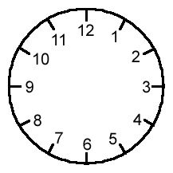

Компьютеры обычно хранят время в секундах, прошедших с 1 января 1970 года — начала «эпохи Unix».

Люди также хранят время относительно какого-то момента в прошлом — обычно имеющего какую-то политическую, культурную или религиозную значимость — в зависимости от календаря. На момент написания этой статьи, прошло примерно 63882260594 секунд с 0 года н. э.

Но в отличие от компьютеров, мы в повседневной жизни не пользуемся *всей* этой информацией. В зависимости от задачи, нам достаточно знания о том, что сейчас 14:00 и пора на обед, или что сегодня четверг и в Subway скидка на итальянский BMT. Вместо целого таймстемпа мы используем его *остаток*, содержащий лишь ту информацию, которая нам нужна.

Самая удобная вещь про остатки в том, что они цикличны: после 12 на часах идёт 1, и поэтому число всегда остается небольшим. Гораздо проще работать с одно- или двузначными числами вместо 11-значных.

**Задача.** Пусть сегодня четверг. Какой день недели будет через год?

Если мы пронумеруем все дни недели от 0 с 6 начиная с понедельника, то четверг получит номер 3. Нам нужно добавить к этому числу 365 и затем взять остаток от деления на 7. Так как `365 % 7` удобно равен 1, то мы получаем, что через год будет пятница (если это не високосный год, в случае чего будет суббота).

*Модулярная арифметика* занимается изучением подобных интересных свойств остатков.
